# Smart Sweep SWMS — workflows

How work actually moves through the system: the operational chain from an
unserved holding to reconciled cash, who does each step, and which API calls
each one makes.

Companion documents: [API reference](API-REFERENCE.md) ·
[User manual](USER-MANUAL.md)

---

## Contents

- [The operational chain](#the-operational-chain)
- [Who does what](#who-does-what)
- [W1 · Survey to customer](#w1--survey-to-customer)
- [W2 · Location verification](#w2--location-verification)
- [W3 · Route planning and assignment](#w3--route-planning-and-assignment)
- [W4 · The daily collection round](#w4--the-daily-collection-round)
- [W5 · Working offline](#w5--working-offline)
- [W6 · Complaint lifecycle](#w6--complaint-lifecycle)
- [W7 · Monthly billing run](#w7--monthly-billing-run)
- [W8 · Payment collection](#w8--payment-collection)
- [W9 · Cash hand-in and reconciliation](#w9--cash-hand-in-and-reconciliation)
- [W10 · Fleet upkeep](#w10--fleet-upkeep)
- [W11 · Live map and telemetry](#w11--live-map-and-telemetry)
- [The monthly cycle](#the-monthly-cycle)
- [Rules the server enforces](#rules-the-server-enforces)

---

## The operational chain

Every household follows the same path. Each arrow is a gate — the next step is
refused until the previous one is complete.

```mermaid
flowchart LR
    A[Surveyed holding<br/>potential customer] -->|convert| B[Household<br/>under service]
    B -->|verify GPS| C[Verified<br/>routable]
    C -->|add to route| D[On a route]
    D -->|assign collector| E[On a round]
    E -->|record visit| F[Served]
    F -->|billing run| G[Billed]
    G -->|record payment| H[Paid]
    H -->|hand in cash| I[Deposited]
    I -->|reconcile| J[Reconciled]

    style A fill:#e8f0e4,stroke:#5a7a4a
    style C fill:#e8f0e4,stroke:#5a7a4a
    style F fill:#e8f0e4,stroke:#5a7a4a
    style H fill:#e8f0e4,stroke:#5a7a4a
    style J fill:#d4e5cc,stroke:#3d5c30
```

The two gates worth knowing before anything else:

1. **An unverified holding cannot be routed.** Location verification is not
   advisory — the server refuses.
2. **A bill's status only changes when a payment is recorded.** There is no
   "mark as paid".

---

## Who does what

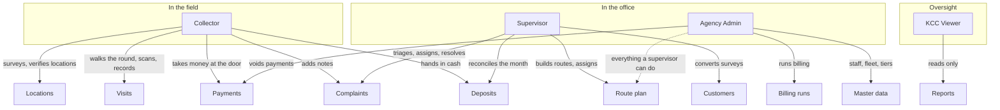

| Role | Owns | Cannot |
|---|---|---|
| **Collector** | Their own round, surveys, location verification, door payments, and complaints in their ward | See another collector's round; recalculate metrics; run billing; void a payment |
| **Supervisor** | Their zone's wards end to end — routes, assignments, complaints, reconciliation | Issue bills; change staff, fleet or tiers; void a payment |
| **Agency Admin** | Everything, city-wide | — |
| **KCC Viewer** | Reading, city-wide | Write anything |

---

## W1 · Survey to customer

Finding the "ghost homes" that are not paying, and signing them up.

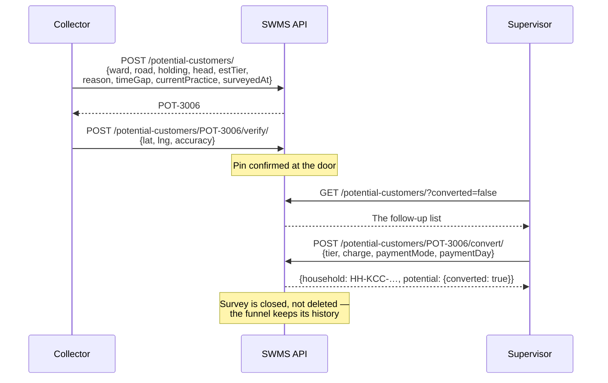

**Why the survey survives conversion.** Deleting it would erase the only record
of how many holdings were approached and how many said yes. `GET
/reports/customer-funnel/` reports `surveyed`, `converted`, `pending`,
`conversionRate`, `byReason` and `monthlyValueAtStake` — the revenue still on
the table — and all of that depends on the closed surveys staying put.

**Every field on `convert` is optional.** Omitted ones fall back to the survey's
estimates: `estTier` becomes `tier`, and the charge follows the tier. Converting
a second time fails with `already_converted`.

---

## W2 · Location verification

The gate that controls everything downstream.

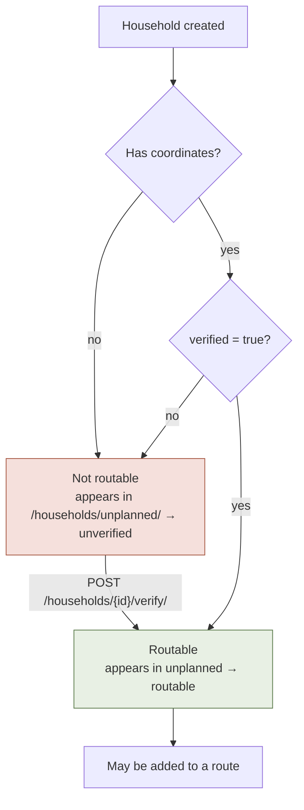

Two ways a pin gets set, kept distinct because their accuracy differs:

| `placedByHand` | Who | Meaning |
|---|---|---|
| `false` | Collector | A GPS fix taken standing at the door, with an `accuracy` in metres |
| `true` | Office user | Dropped on a map from the desk |

The route planner reads `GET /households/unplanned/`, which returns
`{routable, unverified, total}` — already split, so the planner shows "ready to
route" and "blocked, needs a visit" as two separate piles rather than one list
the user has to sort out.

---

## W3 · Route planning and assignment

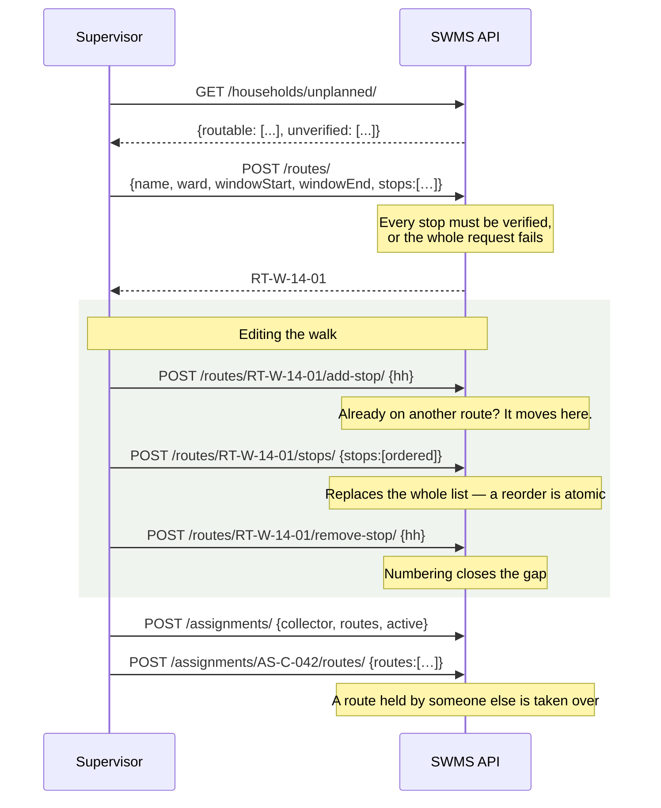

**Use `POST /stops/` for a drag-reorder, not a sequence of add/remove calls.**
Replacing the whole ordered list in one request means the route is never briefly
half-ordered — no intermediate state is ever visible to a collector loading
their round at that moment.

**Reassignment is permissive on purpose.** Dragging a holding to another route,
or a route to another collector, is a normal planning action, so the server
moves it and drops the old link rather than raising a conflict the planner would
have to resolve by hand.

---

## W4 · The daily collection round

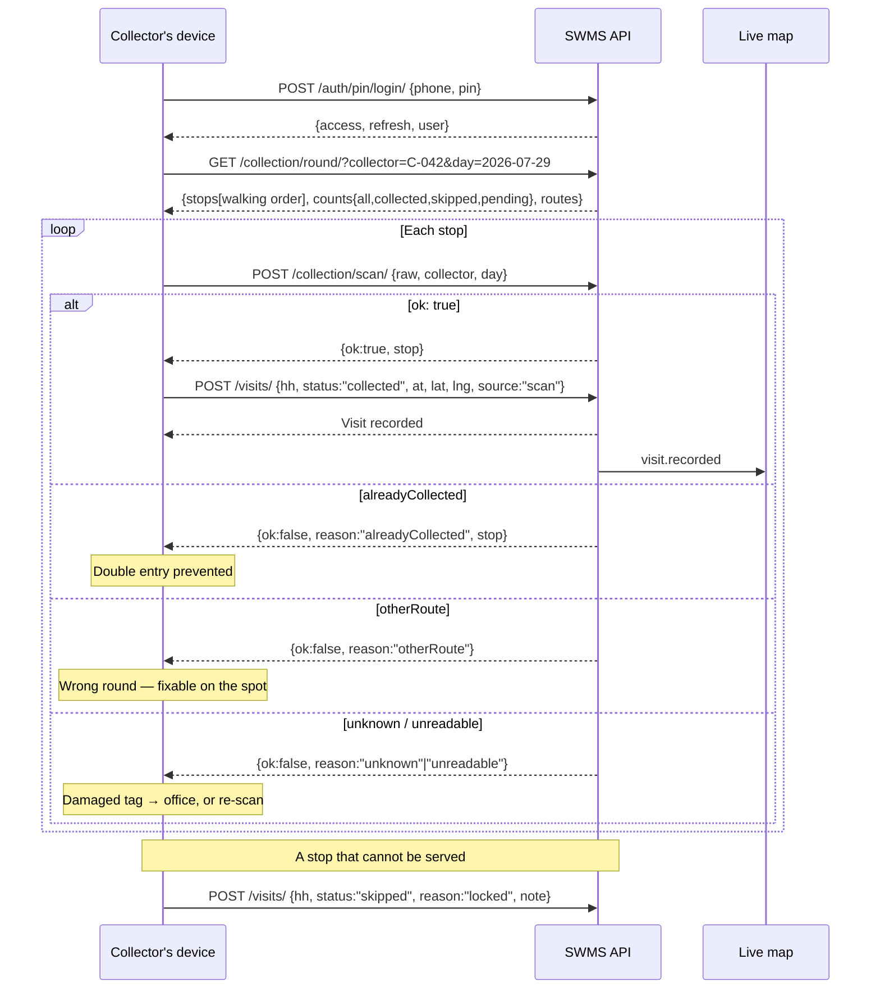

**A scan never fails the request.** All five outcomes come back as 200, because
a wrong-round or worn-label scan is information the collector acts on, not an
error condition. Treating it as a 4xx would make the device show a failure
dialog for what is a routine situation.

**Skip reasons** are a fixed set: `noOne`, `noWaste`, `locked`, `access`,
`refused`. A skip without one is rejected.

**Correcting a skip.** Re-post the same household for the same day with
`status: "collected"`. The unique constraint on `(household, served_on)` means
the existing row is **updated**, not duplicated — one visit per household per
day, always.

**A collector cannot look at someone else's round.** Passing another
`collector=` returns 200 with *their own* round rather than a 403 — the server
silently pins it. Supervisors and admins may look in on anyone, which is how a
round gets reviewed from a desk.

---

## W5 · Working offline

Coverage in the field is unreliable, so a round has to be walkable with no
connection at all.

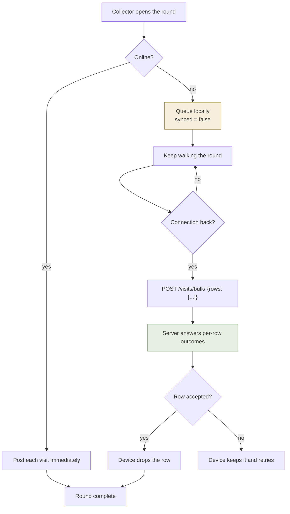

**The bulk endpoint answers with per-row outcomes, not one status code.** A
device has to know precisely which rows it may delete from its queue and which
to keep retrying. One bad row — a household deleted while the device was
offline, say — must not reject the other forty.

This works because of the same-day update rule: replaying a row the server
already has updates that row instead of creating a duplicate, so a retry is
always safe.

`POST /visits/{id}/sync/` marks a queued record as acknowledged.

---

## W6 · Complaint lifecycle

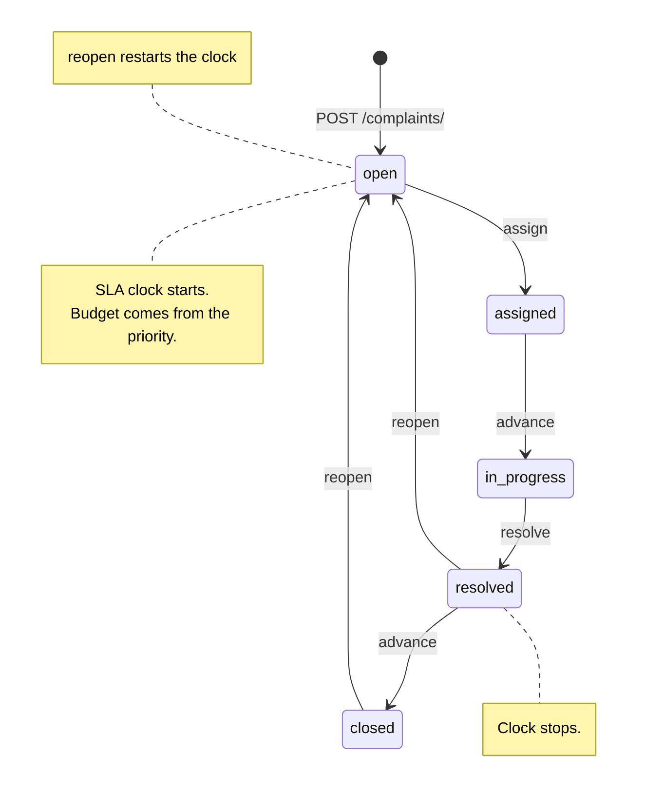

**Status is never a field write.** `PATCH /complaints/{id}/` edits the
description and details; every lifecycle move is its own endpoint, and each one
appends an immutable `ComplaintActivity` row. A ticket cannot change hands
without a trail.

| Action | Endpoint | Also does |
|---|---|---|
| Assign | `POST /{id}/assign/` | `{"assigned": null}` returns it to the pool |
| Advance | `POST /{id}/advance/` | Follows `nextStatus` on the ticket |
| Re-grade | `POST /{id}/priority/` | **Changes the SLA budget, so the clock moves** |
| Resolve | `POST /{id}/resolve/` | Stops the clock, records how |
| Reopen | `POST /{id}/reopen/` | Restarts the clock |
| Note | `POST /{id}/note/` | Trail only; ticket unchanged |
| Photos | `POST /{id}/photos/` | Multipart; all files validated before any is stored |

**Collectors may run every one of these**, not just `note` — the viewset's write
roles are `OPERATIONAL_WRITERS | {COLLECTOR}`, because collectors progress the
jobs on their own round. Ward scoping already stops them reaching another ward's
tickets, so no further restriction is applied. Verified live: the Ward 14
collector sees 2 of the 6 seeded complaints and is accepted on `assign`,
`priority` and `note`; the KCC viewer is refused with `permission_denied`.

### SLA budgets

| Priority | Budget | Rank in triage |
|---|---|---|
| `urgent` | 4 hours | highest |
| `high` | 12 hours | |
| `medium` | 24 hours | |
| `low` | 48 hours | lowest |

Set explicitly with `sla` on create; otherwise it derives from the priority.
`slaState` on each row tells the UI whether a ticket is comfortable, close or
breached, computed against the resolution time once resolved rather than
against "now" — so a ticket resolved on time does not drift into breach on the
report afterwards.

`GET /complaints/summary/` honours the same filters as the list, so *"breached
tickets in Ward 14"* is one request.

---

## W7 · Monthly billing run

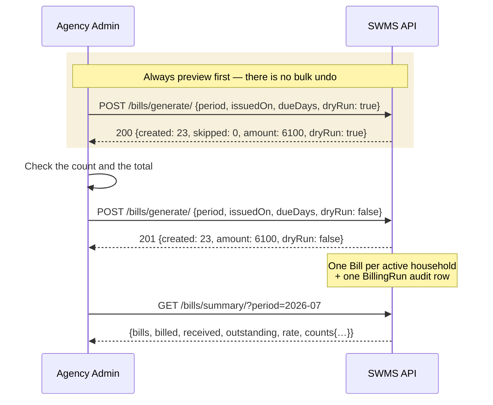

**A bill can only come from a run.** `POST /api/bills/` answers 400
`use_billing_run` for everyone but a superuser:

> A hand-made bill would have no `run`, so the month's `BillingRun` totals would
> no longer describe the month, and a household could quietly end up charged
> twice for reasons no audit trail explains.

Re-running a period is safe — households already billed for the month come back
in `skipped` rather than being charged again.

`dueDays` (default 10) sets `dueOn`, which is what makes a bill *overdue* rather
than merely *unpaid*.

---

## W8 · Payment collection

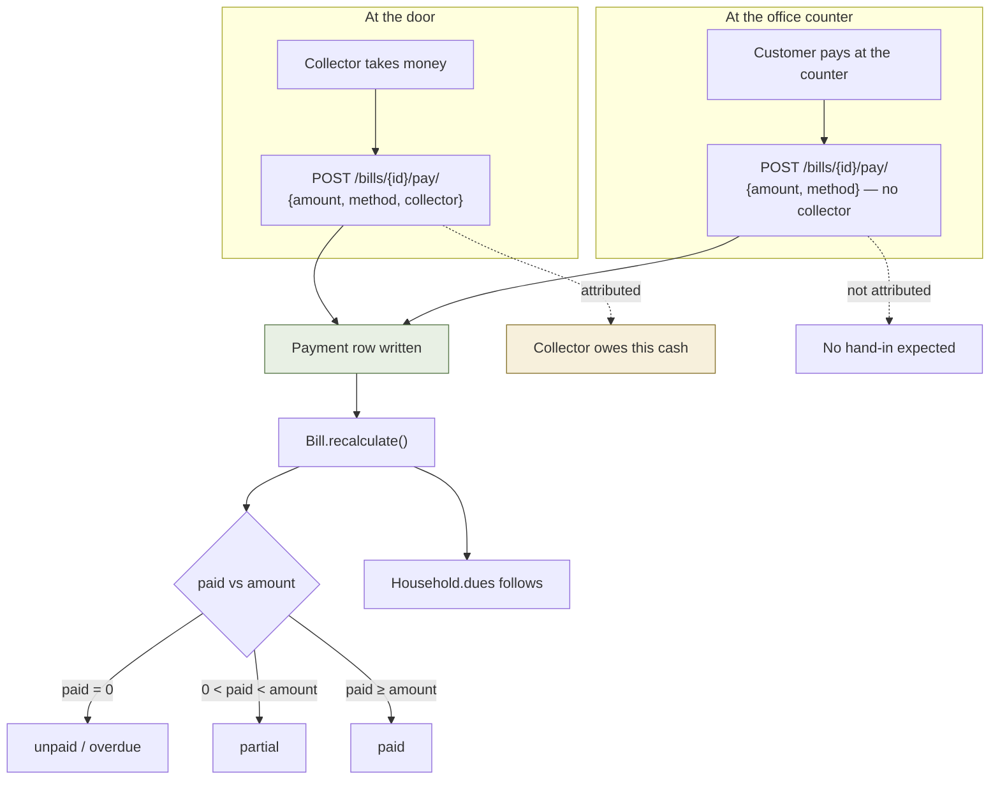

**Recording a payment is the only thing that moves a bill.** `Bill.status` is a
cache derived from the payments that exist; `Household.dues` follows from that.
There is no endpoint that sets a bill to paid.

**Partial payments are normal.** Post several against one bill; the settlement
state moves on its own as the total crosses the thresholds.

**Whether `collector` is set is what makes reconciliation possible.** Money
attributed to a collector is money they must later hand in; counter payments
have no collector and no hand-in is expected. Getting this wrong is what makes a
cash position look wrong at month end.

**A payment's period is the month it was *taken* in**, not the month its bill
covers. A July bill settled in August is August money — which is exactly what
makes a collection lag visible instead of invisible.

**Corrections.** Payments are immutable in practice. To fix a mis-keyed one:
`POST /payments/{id}/void/` (agency admin only), then re-record it. Voiding
restates the bill from the payments that remain.

> Void is admin-only deliberately: it is the one operation that can make money
> on record disappear, so it does not belong to the person who keyed it in.

---

## W9 · Cash hand-in and reconciliation

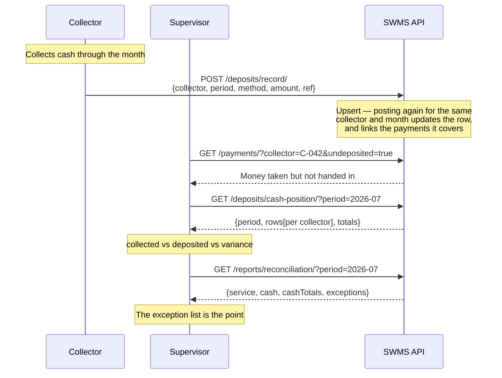

**Deposits are deliberately not ward-scoped.** A hand-in is a fact about a
collector and a month, not about a ward. Scoping it by ward would hide hand-ins
from the very supervisor reconciling them.

**The reconciliation report's exceptions are the deliverable.** Service versus
revenue and cash taken versus cash handed in are the summary; the exception
lists are what someone actually acts on. An export flattens the cash rows into
the sheet and returns the exceptions alongside in the JSON body rather than
dropping them.

---

## W10 · Fleet upkeep

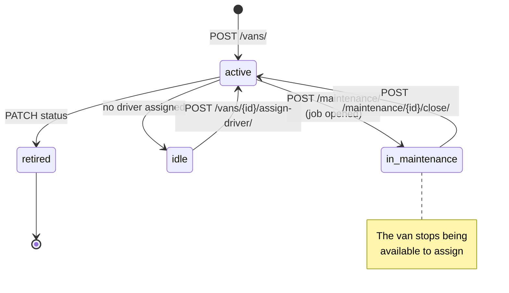

**Opening a maintenance job can take the van off the road**, and closing it
computes downtime and frees the van. Omit `downtime` on close and it is derived
from the open and close timestamps.

**Assigning a driver releases them from any other van**, so one person never
appears to be driving two.

`GET /vans/alerts/` returns expiring paperwork (fitness, tax, insurance, permit)
and service-due warnings, computed against **today** — not against a fixed date,
which is what froze the mock's panel.

`GET /vans/kpis/` gives availability, downtime, average km/l by fuel type, fuel
and maintenance spend.

---

## W11 · Live map and telemetry

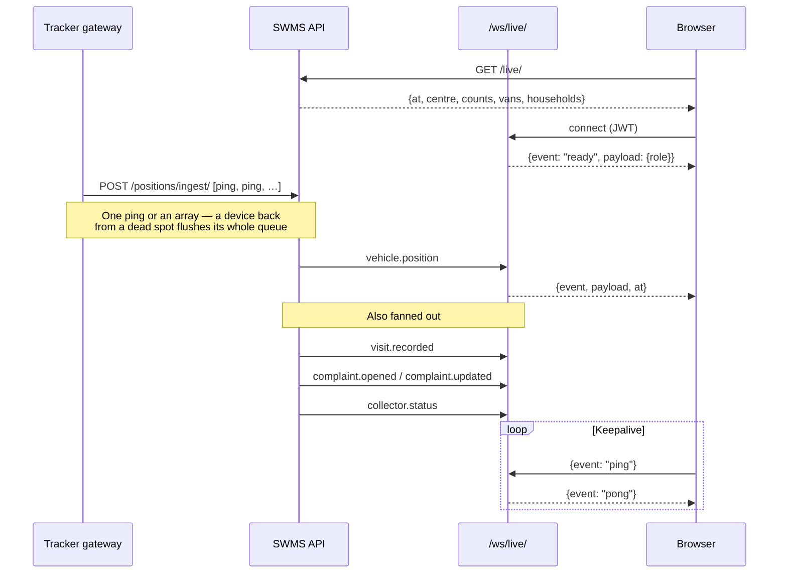

**A dropped map update never fails the write that produced it.** Broadcast
failures are swallowed and logged — recording a collection must not fail because
a websocket was unavailable.

Clients that cannot use websockets fall back to polling `GET /live/`.

Single-process development needs no configuration. Multi-process realtime needs
`REDIS_URL`; blank means an in-memory channel layer that only reaches clients on
the same process.

---

## The monthly cycle

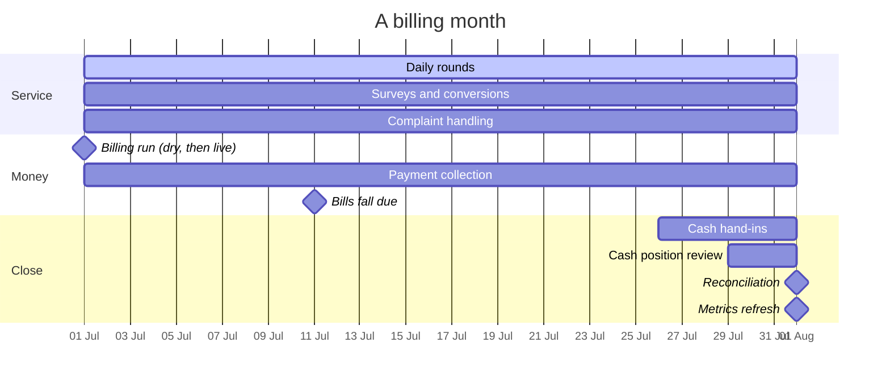

| When | Who | Does |
|---|---|---|
| Month start | Agency Admin | Dry-run then run `POST /bills/generate/` |
| Daily | Collector | Walk the round; record visits; take payments |
| Daily | Supervisor | Triage complaints; review rounds; fix routes |
| Ongoing | Collector | Survey unserved holdings; verify locations |
| `issuedOn + dueDays` | — | Unpaid bills become **overdue** |
| Month end | Collector | `POST /deposits/record/` for the month |
| Month end | Supervisor | `cash-position`, then `/reports/reconciliation/` |
| Month end | Agency Admin | `POST /collectors/refresh-metrics/` |

---

## Rules the server enforces

These are not client-side conventions. Each is enforced in the API, and working
around them is not possible from the frontend.

| Rule | Where | Consequence of ignoring it |
|---|---|---|
| An unverified holding cannot go on a route | Route create / add-stop | Request fails |
| A bill comes only from a billing run | `POST /bills/` | 400 `use_billing_run` |
| A bill's status changes only via a payment | `Bill.recalculate()` | No endpoint exists to do otherwise |
| One visit per household per day | DB unique constraint | A re-post updates, never duplicates |
| A complaint's status is not writable | `PATCH` excludes it | The move must go through an action, which writes the trail |
| A collector sees only their own round | `own_round_only()` | Another `collector=` is silently replaced with their own |
| Ward scoping comes from the role | `visible_ward_ids()` | A query parameter cannot widen it |
| Only an agency admin voids a payment | `IsAgencyAdmin` | 403 |
| Only an agency admin refreshes metrics | `IsAgencyAdmin` | 403 |
| Reassigning a route or stop is allowed | `set_routes`, `add_stop` | The old link is dropped, not an error |
| Tonnage is an estimate | `waste_by_zone` | Every row carries `estimated: true` |
| A stale map update never fails a write | `publish()` | Broadcast errors are logged and swallowed |
